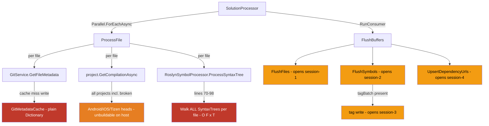
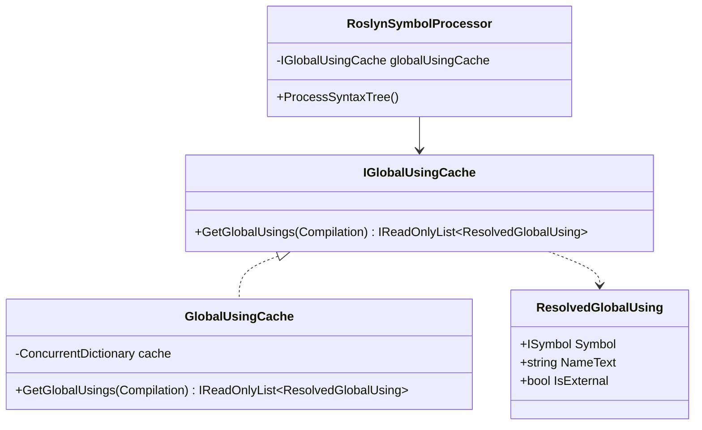
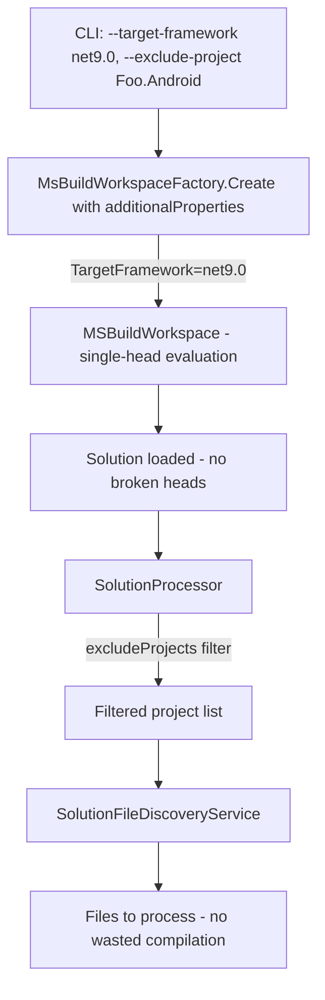
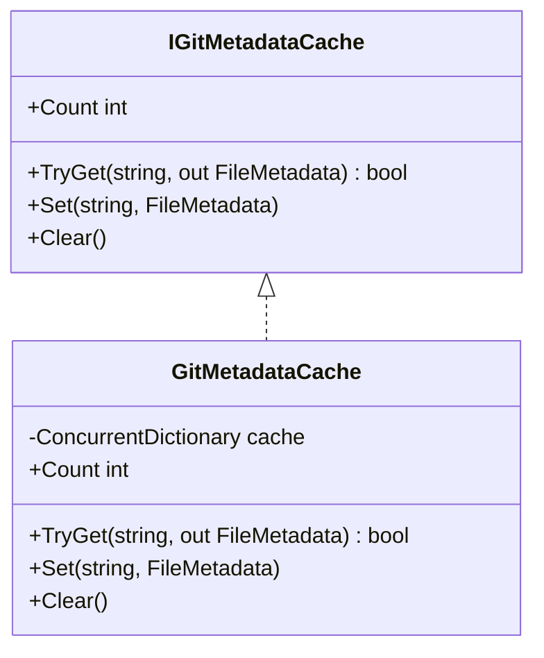
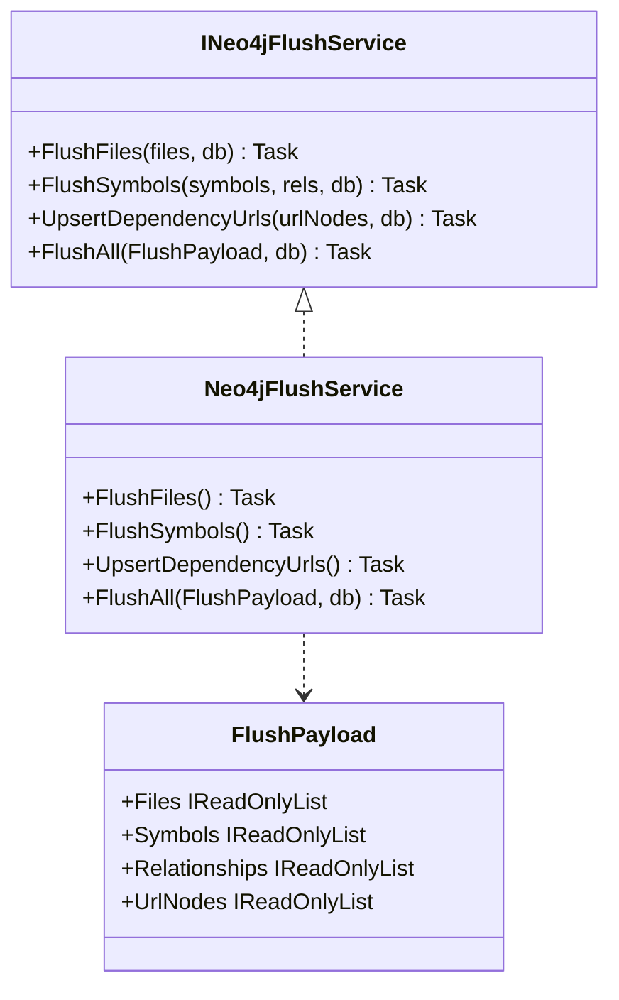
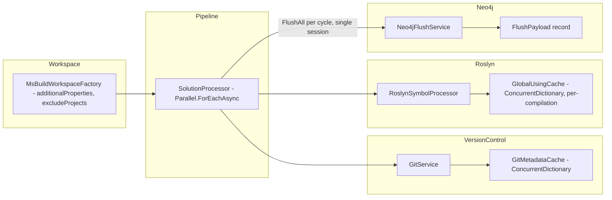

# Architectural Assessment — Roslyn Ingestion Performance Remediation

Context: Microsoft.Maui.sln ingestion (13,056 files) stalled at 61% after 4.5 hours. Four confirmed root causes below, each with current design, proposed design, implementation considerations, and priority.

## Current Structure — Violation Map

---

## Finding 1 — Quadratic Global-Using AST Traversal (Highest Priority)

### Current design
`RoslynSymbolProcessor.cs` lines 70-98 (`ProcessSyntaxTree`): for every file processed, loops over `semanticModel.Compilation.SyntaxTrees`. For each tree other than the current one, calls `tree.GetRoot()` then `root.DescendantNodes().OfType<UsingDirectiveSyntax>()` — a full AST walk — then resolves each global-using symbol via `semanticModel.Compilation.GetSemanticModel(tree).GetSymbolInfo(u.Name)`.

Cost: O(F x T) where F = files in project, T = syntax trees in project. At MAUI scale (~13,000 files, ~500 trees in large projects), this is millions of tree-root fetches and descendant-node scans before any type processing runs.

Secondary defect, line 87: `relBuffer.Any(r => r.FromKey == fileKey && r.ToKey == depKey && ...)` — O(relBuffer.Count) linear scan inside the inner loop, compounds on large buffers.

### Proposed design
`IGlobalUsingCache` scoped to a `Compilation`. Populated once (lazily on first file, or eagerly at compilation open) and reused for all files sharing that compilation.

`GlobalUsingCache.GetGlobalUsings` walks all syntax trees once per compilation, keyed by `compilation.Assembly.Identity.ToString()` via `ConcurrentDictionary.GetOrAdd` (thread-safe, no lock on hot path). `ProcessSyntaxTree` replaces lines 70-98 with a call to this cache and iterates the pre-resolved list.

Fix the `relBuffer.Any(...)` scan by building a `HashSet<(string from, string to)>` at the call site for O(1) dedup.

**API surface:** `RoslynSymbolProcessor` constructor gains one parameter (`IGlobalUsingCache`), registered as singleton or compilation-scoped factory in DI. `IRoslynSymbolProcessor.ProcessSyntaxTree` signature unchanged.

**Backward compatibility:** additive constructor param only; existing test doubles for `IRoslynSymbolProcessor` unaffected.

**Priority/Effort:** Critical / Low-Medium. Single new interface + impl, surgical edit to one method. Eliminates the dominant per-file cost on large projects.

---

## Finding 2 — Wasted Work on Unbuildable Multi-Platform Target Heads (High Priority)

### Current design
`MsBuildWorkspaceFactory.Create()` sets `DesignTimeBuild=true`, `BuildingInsideVisualStudio=true`, `SkipCompilerExecution=true`, `ResolveAssemblyReferencesSilently=true` — no `TargetFramework` property set. `OpenSolutionAsync` evaluates all target heads (net9.0-android/ios/windows/tizen/gtk/maccatalyst) plus base net9.0. Each generates diagnostic warnings and a partial workspace `ProcessFile` still attempts to compile (line 267), producing the logged exceptions per unbuildable head. `SolutionProcessor.ProcessSolution` has no project/TF filter before `discoveryService.GetFilesToProcess` (line 96); the workspace-warning handler (line 54) logs but never skips.

### Proposed design
Two complementary mechanisms:

**A — MSBuild property injection at workspace creation.** `MsBuildWorkspaceFactory.Create()` accepts optional `IDictionary<string,string> additionalProperties`. Caller passes `TargetFramework=net9.0` to constrain evaluation to one head — standard MSBuild property, suppresses multi-targeting.

**B — CLI project-exclusion filter.** New `--target-framework` / `--exclude-project` CLI options. `SolutionProcessor.ProcessSolution` accepts `IEnumerable<string> excludeProjects`, filters `solution.Projects` before discovery.

**API surface:** `IWorkspaceFactory.Create()` gains optional `IDictionary<string,string>? additionalProperties = null`. `SolutionProcessor.ProcessSolution` gains `IEnumerable<string>? excludeProjects = null`. Both additive, backward-compatible.

**Priority/Effort:** High / Medium. CLI plumbing + two signature additions + factory delegation, no structural refactor. `TargetFramework` injection alone likely recovers most of the 150+ warning load.

---

## Finding 3 — Non-Thread-Safe Git Metadata Cache (Medium Priority)

### Current design
`GitMetadataCache` holds `private readonly Dictionary<string, FileMetadata> _cache`. `GitService.GetFileMetadata` (lines 221-254): cache hit returns immediately (safe). Cache miss spawns a git process then calls `metadataCache.Set(filePath, result)` (line 253) — writing into a plain `Dictionary` from inside `Parallel.ForEachAsync` (`SolutionProcessor` line 119, degree `Math.Max(2, ProcessorCount)`).

Plain `Dictionary` is not thread-safe for concurrent writes or concurrent read/write. Pre-warm makes misses rare, but MAUI's generated files, SDK-injected sources, and untracked files will still miss. Concurrent unsynchronized writes risk corrupting bucket state — silent wrong reads or thrown `InvalidOperationException`.

### Proposed design
Swap backing store to `ConcurrentDictionary`. `IGitMetadataCache` contract unchanged — fix confined to `GitMetadataCache.cs`.

`ConcurrentDictionary` with `StringComparer.OrdinalIgnoreCase` key comparer — `TryGetValue`, `TryAdd`/indexer, `Clear` all atomic. On the miss path (`GitService.GetFileMetadata` line 253), indexer-set semantics (last-writer-wins) are acceptable since all git-log outputs for the same path are identical.

**API surface:** none — `IGitMetadataCache` unchanged, only `GitMetadataCache` modified.

**Priority/Effort:** Medium / Trivial. Single-file change, zero API impact, eliminates a real data race cheaply. Apply before any parallelism increase.

---

## Finding 4 — Excess Neo4j Session Churn Per Flush Cycle (Lower Priority)

### Current design
`SolutionProcessor.FlushBuffers` calls `FlushFiles`, `FlushSymbols`, `UpsertDependencyUrls` sequentially. Each opens its own `await using var session = driver.AsyncSession(...)`. `FlushSymbols` conditionally opens a second session for tag writes (line 128). Per flush cycle: 3-4 sessions opened.

Driver pools connections internally, so cost is checkout/return overhead, not full handshake — but on a long run with frequent flushes it's measurable and unnecessary. More importantly, opening separate sessions breaks the semantic unit: one flush cycle (delete-prior-symbols, upsert-file, upsert-symbols, merge-rels, upsert-tags, upsert-url-nodes) is one logical operation that should run in one session context.

### Proposed design
Add `FlushAll` to `INeo4jFlushService` accepting all four payload types, executing inside a single session.

`FlushAll` opens one session, runs all writes inside a single `ExecuteWriteAsync` transaction scope (or sequentially within the session, per atomicity needs), closes. `SolutionProcessor.FlushBuffers` builds a `FlushPayload` and calls `graphService.FlushAll(payload, databaseName)`. Existing three methods remain on the interface for independent callers (e.g. dependency ingestor) — not removed.

**API surface:** `INeo4jFlushService` gains `FlushAll`; new `FlushPayload` record; `SolutionProcessor.FlushBuffers` updated. Existing callers of individual methods unaffected.

**Alternative considered:** pass `IAsyncSession` into each method — rejected, inverts session-lifetime ownership onto callers and leaks infrastructure concerns across the interface boundary.

**Priority/Effort:** Lower / Low-Medium. Additive interface change + new record + updated `FlushBuffers`. No correctness risk; benefit scales with flush frequency.

---

## Proposed Component Boundaries (Post-Remediation)

---

## Priority and Effort Summary

| # | Finding | Impact on 4.5h stall | Effort | Change scope |
|---|---------|----------------------|--------|---------------|
| 1 | Global-using O(F x T) traversal | Dominant CPU cost — eliminates redundant AST walks across 13k files | Low-Medium | New `IGlobalUsingCache` + impl; edit `RoslynSymbolProcessor` lines 70-98 |
| 2 | Unbuildable multi-platform heads | Eliminates wasted compilation attempts, 150+ MSBuild warnings | Medium | `MsBuildWorkspaceFactory.Create` optional properties; CLI `--target-framework`/`--exclude-project` |
| 3 | Unsafe git cache race | Correctness fix — rare but real corruption risk under parallelism | Trivial | `Dictionary` to `ConcurrentDictionary` in `GitMetadataCache` |
| 4 | Neo4j session churn | Reduces session checkout overhead across all flush cycles | Low-Medium | `FlushPayload` record; `INeo4jFlushService.FlushAll`; update `FlushBuffers` |

Finding 3 trivially safe, apply first regardless of sequencing. Findings 1 and 2 together address the confirmed stall cause. Finding 4 is structural cleanup, improves efficiency at scale.

## Immutable Constraints

1. `IRoslynSymbolProcessor.ProcessSyntaxTree` signature must not change — contract boundary between Roslyn handler chain and processing pipeline.
2. `IGitMetadataCache` interface must not change — implementation swap only.
3. `INeo4jFlushService` existing methods must not be removed — additive extension only.
4. `Parallel.ForEachAsync` parallelism model in `SolutionProcessor` is load-bearing for throughput — thread-safety fixes must accommodate this degree of parallelism, not reduce it.
